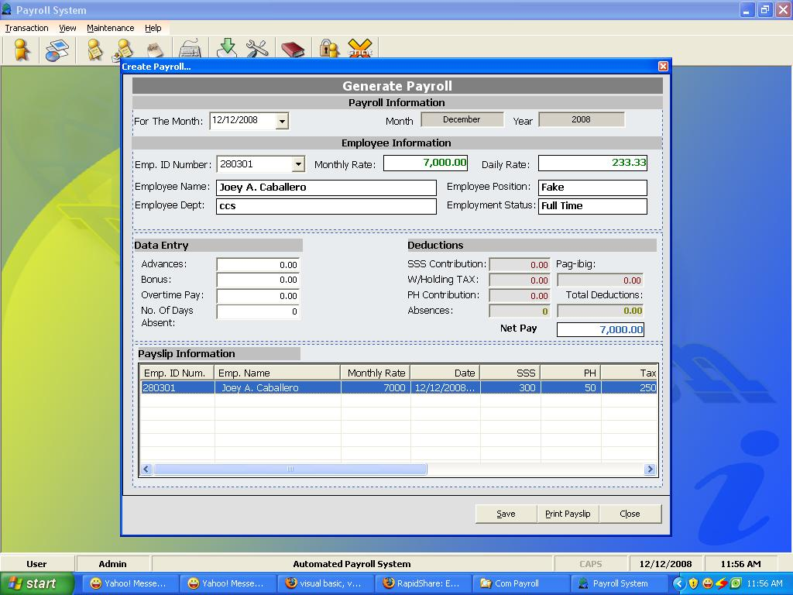



## Complete Payroll System

### Description

This is a complete payroll system w/ Daily Time Report

this code is intended for those developer who wanted to

create their own payroll system...

hope this one can help you..

Please don't forget to vote...

you can download the Hookmenu.ocx on this link..

thank you..

http://rapidshare.com/files/171926383/HookMenu.zip.html
 
### More Info
 

             |
---                |---
**Submitted On**   |2008-11-25 23:37:12
**By**             |[Joey A\. Caballero](https://github.com/Planet-Source-Code/PSCIndex/blob/master/ByAuthor/joey-a-caballero.md)
**Level**          |Intermediate
**User Rating**    |4.9 (54 globes from 11 users)
**Compatibility**  |VB 4\.0 \(16\-bit\), VB 4\.0 \(32\-bit\), VB 5\.0, VB 6\.0
**Category**       |[Complete Applications](https://github.com/Planet-Source-Code/PSCIndex/blob/master/ByCategory/complete-applications__1-27.md)
**World**          |[Visual Basic](https://github.com/Planet-Source-Code/PSCIndex/blob/master/ByWorld/visual-basic.md)
**Archive File**   |[Complete\_P2136621292008\.zip](https://github.com/Planet-Source-Code/joey-a-caballero-complete-payroll-system__1-71504/archive/master.zip)

